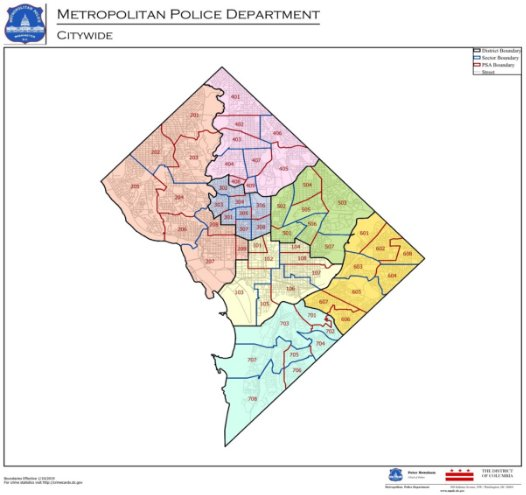

The cases of gun violence in Washington DC have become an epidemic.  Washington DC is stumbling after experiencing a tragic weekend because of gun deaths and injuries. In July of this year, a shooting occurred in the southeastern area of Washington, D.C. and resulted in the death of a 6-year-old and the injury of five other people. The shootings have resulted in a lot of frustration among people in the Washington, D.C. In May of this year, another shooting in Washington, DC resulted in three injuries and three deaths. In Washington DC, gun violence has affected generation after generation bringing about a sad realization that it may never end. In Washington DC, gun violence has affected lots of people. What’s even more frustrating is that gun violence doesn’t seem to improve over time. The president of the United States, Joe Biden, held a meeting with Mayor Muriel in July to discuss gun violence prevention. Muriel also addressed the issue on national television following a period of violence in late June. Last year democrats went to the streets in a mission to defund the police and to protest police violence. The president is working on a [national plan](https://www.whitehouse.gov/briefing-room/statements-releases/2021/06/23/fact-sheet-biden-harris-administration-announces-comprehensive-strategy-to-prevent-and-respond-to-gun-crime-and-ensure-public-safety/) to fight crime. The plan aims to curb the illegal selling of guns and place the relief funds under law enforcement.

More than 2,000 people were shot in 2020 between the months of January and October. In 2021, a total of 1921 people were shot between January and October. The number of shootings has reduced by 5% from last year. District 6 experienced the highest number of shootings in 2020 and 2021, while District 2 had the lowest number of shootings. Districts 1, 2, 3, and 4 experienced a rise in shootings this year from 2020, while districts 5, 6, and 7 experienced a drop in shootings. Compared to the shootings that occurred in 2020, Districts 1, 2, 3, and 4 experienced an increase with 7%, 53%, 11%, and 3%, respectively.  Districts 5, 6, and 7 experience a drop in shootings by 13%, 16%, and 10%, respectively. 

描述已自动生成](Aspose.Words.d57bea36-5c97-44bf-aa99-83cd7a64a0f9.002.png)

The number of shootings due to gun violence surged by forty percent from 2019 to 2020 The incidences where children stole guns from adults increased by forty-five percent. [Researchers have realized that intimate-partner violence, gun-related suicides, and family violence continue to grow](https://www.urban.org/research/publication/gun-violence-affects-economic-health-communities). According toYasemin Irvin-Erickson and other reearchers’ research on shooting, along with the increased ownership of guns, the covid-19 pandemic caused a slowdown that affected minority and low-wage workers and kept black men and women out of jobs longer than the whites. The protests and the pandemic resulted in thinned officer ranks, forcing them to control the unrest. The former district judge has planned a decline in street and car stops labeled as proactive policing. The young were particularly vulnerable with activities revolving around support and structure through the period. 

Mass shootings were highly absent from the headlines until two deadly incidents occurred in March in Boulder and Atlanta. However, throughout 2020 and 2021, the shooting levels increased and did not receive attention beyond the places where the shootings took place.This happened amid the rising recommendations to handle gun violence as a public health concern and matter of law.

Analysis indicates that in the last three years, the FBI found [2759 bullet casings](https://www.washingtonpost.com/dc-md-va/2021/07/22/shooting-increase-dc-gun-violence/) which are byproducts of shootings involving shotguns, pistols, and rifles. The highest number of bullet casings gathered in the district during that period demonstrated the number of pulled triggers. At least 260 cases were collected from the Benning strip extending from Shrimp to the Maryland line. The bullets have pockmarked cars, shattered windows, enclosed in home walls, and struck people. People who live, shop, and work in Marshall Heights experience gunfire every day. A man named [Demeitri Anderson](https://www.washingtonpost.com/dc-md-va/2021/07/22/shooting-increase-dc-gun-violence/) was shot outside a barbershop in Marshall Heights was on his way to a job interview. In another instance, a bullet was fired at the house of George Hood, where he lived with his wife along Benning road. The people who live in Marshall Heights have struggled to fight for resources, land, and their lives.

In 2020, the shootings reached a 16-year high across Washington DC. Statistics indicate that the number of individuals who get shot and survive has risen to more than 60% from 2018 to 2020. The district deploys extra police and other resources on areas where crime is prevalent. Marshall Heights has been labeled a chief crime zone this year. The mayor has concentrated on Building Blocks DC, a public health approach that fights drug addiction, poverty, and joblessness and addresses the causes of violence. 

Officials of the local public have not identified the leading cause of increased shootings, though they blame the shootings on the pandemic and increase in the use of guns. The district's mayor, Bowser, acknowledged that the global covid-19 pandemic has heavily affected our towns and cities in ways yet to be fully determined. Therefore, one of the causes of the increased shootings could be the covid-19 pandemic. The United States does not have measures such as the national firearms registry. People in all states, including Washington DC, can lawfully carry firearms openly in public. Therefore, the increased number of shootings can be blamed on the lack of laws to restrict ownership and use of guns. The government seems to prioritize gun ownership over respect for human rights. Andy James, a volunteer for Brady said, "I don't know much about the number of shootings in D.C., but during my time as a volunteer, I came into contact with many shooting victims. They were either members of the family who died in shootings or experienced shootings. In fact, almost all the victims I have contacted are dissatisfied with the government's current policies. They hope that the government can do more effective management; this is also the goal Brady has been working on.”Despite the increased circulation of firearms, the government continues to set up regulations that could save many people. According to research, gun availability increases the risk for dangerous shootings.

The government requires background checks on all people purchasing guns to make it hard for shooters to buy them. Background checks are vital in the enforcement of gun laws and in ensuring that guns do not land in the wrong hands (Bieler et al., 2014). Since the law was passed, the rate of gun homicide has reduced by forty percent, and the rate of gun suicides has decreased by 15%. The federal regulations require that every purchaser of handguns must be twenty-one years of age. Raising the minimum age to 21 is significant in preventing gun ownership by school-age shooters.

Additionally, the local government plans to direct relief money to prevent gun violence. The funding could go a long way in helping organizations and cities to address the mental health problems related to violence, including depression, anxiety, feelings of isolation, and post-traumatic stress disorder. In areas where gun violence is prevalent, the government pulled out a plan to address individuals' fears, anger, and pain to reduce the risk of conflict resolution in dangerous or fatal ways (Diaz, 2013). For instance, in D.C., leaders set up a program to offer grants to individuals and groups promoting public safety.  

The number of deaths by gun violence increased at a very high rate in the last year due to the covid-19 pandemic. This year the number of shootings has decreased compared to the previous year. This signifies that the pandemic is the most significant underlying cause for gun violence. "The downtown area of Washington, D.C. and the east have always been areas where shootings are frequent. I once encountered a shooting in Adams Morgan last year. The shooting happened only two blocks away from me. It was horrible.",Sherry Den, an H.R. officer in an I.T. company in D.C., said," As a Chinese, I am amazed that there are so many shootings in the U.S. capital." The total number of shootings has certainly decreased because of the measures taken by the government to reduce and prevent more gun violence from occurring. However, in another interview, The gun violence pandemic has also claimed the lives of young people and children. Bingru Wang, DC's correspondent of China Phoenix Satellite T.V., said, "During my years as a reporter, I have often been exposed to shootings that took place here. I remember two particularly brutal shootings this year. One was the sound of gunshots during a baseball game at Washington National Stadium. And about the same time, there was a six-year-old girl who was involved in a gun battle nearby and died."  

**Conclusion**

Undoubtedly, there has been an increase in gun violence in Washington DC during the covid-19 pandemic. Homicides in the district are on the same level as they were at the same time last year. The crime has gone down by two percent compared to the year 2020. It is certainly not good news that the gun violence levels are still high during the pandemic. However, the cases this year have not increased from the last year. Gun violence cases have claimed many lives and instilled fear in those living in high crime zones. Therefore, the government needs to reduce the causes of gun violence considerably.  

**References**

Irvin-Erickson, Y., Lynch, M., Gurvis, A., Mohr, E., & Bai, B. (2017). Gun Violence Affects the Economic Health of Communities. Urban Institute. https://www. urban. org/research/publication/gun-violence affects-economic-health-communities. Accessed, 22.

Loeffler, C., & Flaxman, S. (2018). Is gun violence contagious? A spatiotemporal test. Journal of quantitative criminology, 34(4), 999-1017. 

Bieler, S., & La Vigne, N. (2014). Close-Range Gunfire around D.C. Schools. Urban Institute. 

Irvin-Erickson, Y., La Vigne, N., Levine, N., Tiry, E., & Bieler, S. (2017). What does gunshot detection technology tell us about gun violence?. Applied Geography, 86, 262-273.

Diaz, T. (2013). The last gun: How changes in the gun industry are killing Americans and what it will take to stop it. New Press, The. 
