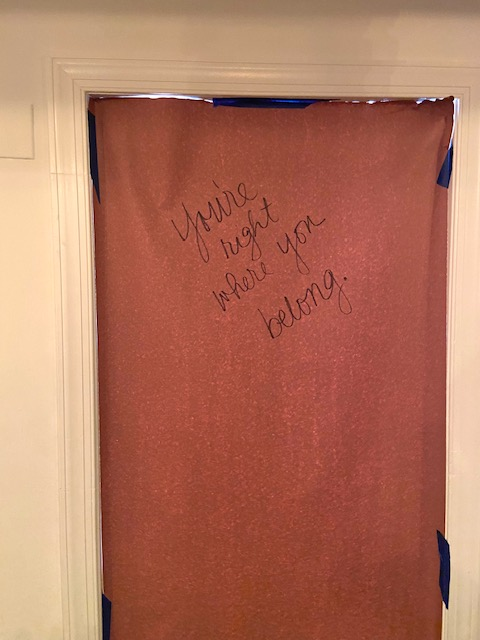

The smell of fresh paint floats around the room as the walls slowly change color, stroke by stroke. The unmistakable hum of a drill installing the thick, soft, and regal theater curtains on the windows upstairs. The sizzle of the flattop in the kitchen, while they work on the perfect breakfast sandwich recipe. 

Rach Pike, 36, and Jo McDaniel, 40, have been working on creating the As You Are Bar on the corner of Eighth and E for some time now.  Listening to them talk about it, you'd think that they were born to do this- and based on their history, they kind of were.

Both Pike and McDaniel just came from past jobs in LGBTQ night life and are fierce advocates for all in the community. Rach worked as the head of security, and Jo as the former general manager, at A League Of Her Own lesbian bar in Adams Morgan, when they realized they could make their own space. They could make a space for everyone in the LGBTQ community, regardless of how others saw the space should be used.

"I wanted better, and I didn't know if anyone else could do it."  McDaniel explained as she looked out at the space. 

"All the things that are all the imperfections. So we started to recognize them and also started to say like, well, let's handle this. We've got the time, right?" Rach added as they looked at Jo, as a smile grew on both of their faces. 

The growth of gay bars and clubs in Washington, DC has been, at least on a data perspective- perplexing. Growing from 7 bars and clubs in 1980 (the hay day of gay nightlife culture)  to 15 in 2021, it looks as if gay bars and clubs are here to stay. For Washington, they might. 

<iframe title="Gay Bars in DC in 1980" aria-label="Map" id="datawrapper-chart-2H0kk" src="https://datawrapper.dwcdn.net/2H0kk/2/" scrolling="no" frameborder="0" style="width: 0; min-width: 100% !important; border: none;" height="753"></iframe>

<iframe title="Gay Bars in DC in 2021" aria-label="Map" id="datawrapper-chart-6jace" src="https://datawrapper.dwcdn.net/6jace/2/" scrolling="no" frameborder="0" style="width: 0; min-width: 100% !important; border: none;" height="786"></iframe>

This 'gay growth' isn't happening everywhere, though. Nationwide, there has been a fall in gay bars and clubs. Famous gay bars that have been around since the beginning of the LGBTQ scene are slowly dying. Flaming Saddles in West Hollywood gone.  The Stud in San Francisco gone. Even the bar that started the fight for LGBTQ rights New York City -The Stonewall Inn- was at risk of shutting down in early 2020. 

The total collected LGBTQ+ bars and clubs in 1980 by Damron's Guide was 1,431. This year the number dropped to 1,182, according to an analysis of listings on their website. That is over a 15% decrease in the total number of LGBTQ bars nationwide. Damron's Guide is a book that used in days before social media to find LGBTQ establishments (like how The Green Book was used in the Jim Crow era to find safe spaces for people of color). 

<iframe title="Gay Bars/Clubs in 1980" aria-label="Map" id="datawrapper-chart-4dcXz" src="https://datawrapper.dwcdn.net/4dcXz/1/" scrolling="no" frameborder="0" style="width: 0; min-width: 100% !important; border: none;" height="445"></iframe>

<iframe title="Gay Bars/Clubs 2021" aria-label="Map" id="datawrapper-chart-b5vxf" src="https://datawrapper.dwcdn.net/b5vxf/1/" scrolling="no" frameborder="0" style="width: 0; min-width: 100% !important; border: none;" height="445"></iframe>

Twenty states have gained LGBTQ bars since 1980, 5 have stayed at the same amount, while 26 have lost at least 1 LGBTQ bar. 

<iframe title="Change in Gay Bars" aria-label="Map" id="datawrapper-chart-EboxG" src="https://datawrapper.dwcdn.net/EboxG/1/" scrolling="no" frameborder="0" style="width: 0; min-width: 100% !important; border: none;" height="513"></iframe>

Some have attributed this decline in LGBTQ bars to the establishment of the 'apps' -Grindr, Tinder, Scruff. These apps  allow for people to meet other LGBTQ people, without having to spend $11 on a vodka cranberry. 

While it is true that since its initial creation in 2008, the app grindr has had a huge population growth of users- from 700,000 in 2010 to nearly 3 million users in 2021, according to the Digital Media Review, there has been no definite link that shows these apps are the reason for the 'gay bars' downfall. Especially since there have always been ways of meeting.

Others, like Garrett Quinby, a gay man, 28, has attributed the reduction to less of a need for 'gay safe' spaces in a modern, more progressive world.

"Its about feeling safer in more spaces. They're not as much of a need," Quinby said.

Chris Pissourious, 27,  who is also a gay man also felt that the numbers represented a general lessened need for them.

"I think the reason is not dwindling popularity, but it feels as if it's not as needed right now," Pissourious said.

Others in the community, like Jo and Rach, believe that a mix of factors has contributed to the decline of these safe spaces. From the lack of financial security and lack of ability to pay for these spaces by those who need LGBTQ spaces the most, like younger LGBTQ individuals, and a toxic culture that has emerged since the Obergefell v. Hodges from those who feel that their fight is over, its convoluted.

"We're like losing kindness. We're losing a sense of community and there's still a great amount of it. But squeaky wheels get the grease so bitchy gays get the attention and build the culture." McDaniel said. "You can't succeed when you exclude."

"The Marriage Equality Act passed and the privileged queers, whether that be white, male, cis; Kind of stopped fighting because they got it. They were safe," Pike added.

The disappearance of LGBTQ safe spaces, some in the community argue, is just the beginning of a greater trend. This year, the most anti-trans legislation has been passed, ever. 17 anti-LGBTQ legislations has been enacted this year while over 10 more anti-LGBTQ bills sit on governors' desks, according to records from the Human Rights Campaign.

Additionally, hate crime data from the FBI has showed an increase in offences for being LGBTQ. There was a rise of 11.5% more hate crimes motivated by sexual or gender identity. The safety that the LGBTQ community gets in their LGBTQ community bars has not disappeared- it is still very needed. 

There are some promising signs of change, though.  Washington DC's thriving LGBTQ nightlife scene is an example of when people invest their money back into their communities, they can help. From supporting the queer owned bed and breakfast a town over, or just actively avoiding giving places that don't support all within the community- it is possible to continue having impactful safe spaces for the LGBTQ community. 
	
When asked about the time that made them realize that they were doing their right path, Pike beamed as McDaniel looked at them smiling.
      
"I'll never not work in this industry this way. Like I have way too much ability to impact the safety of humans that are in need -That are my people ."

